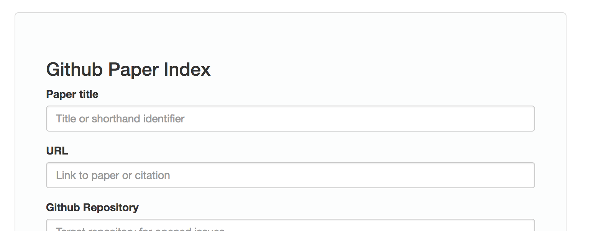
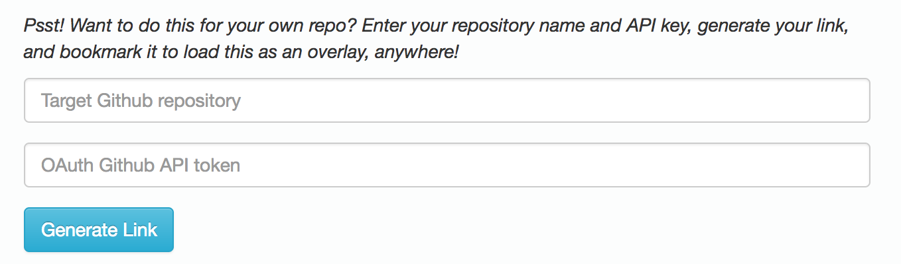
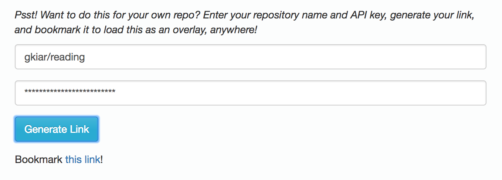
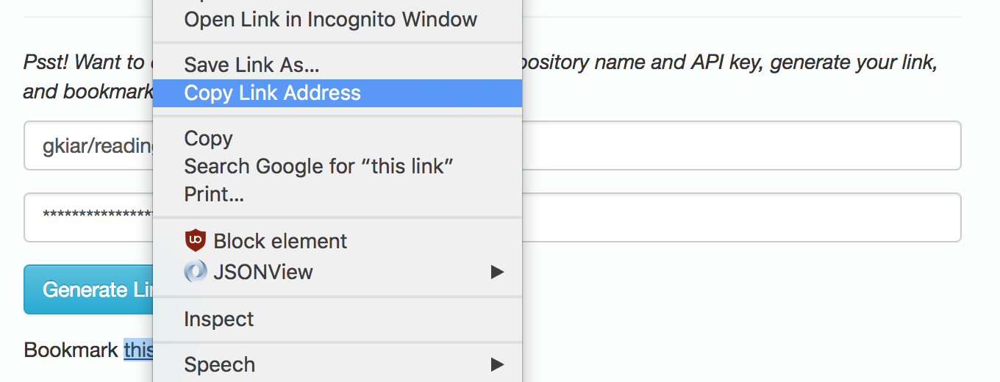
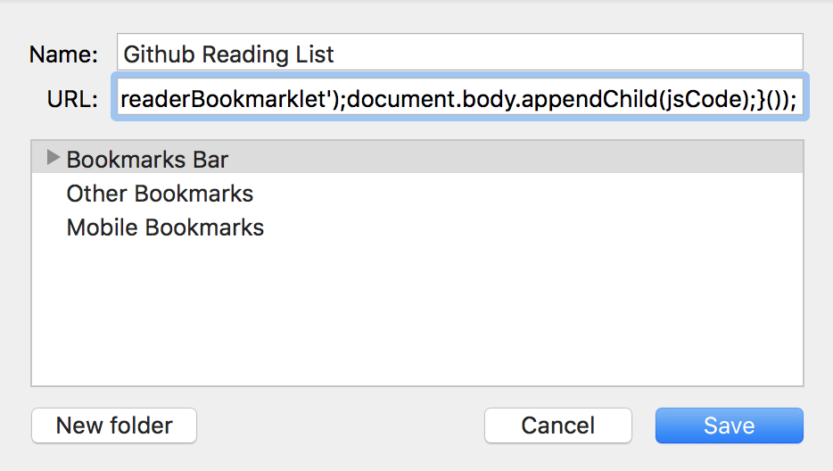
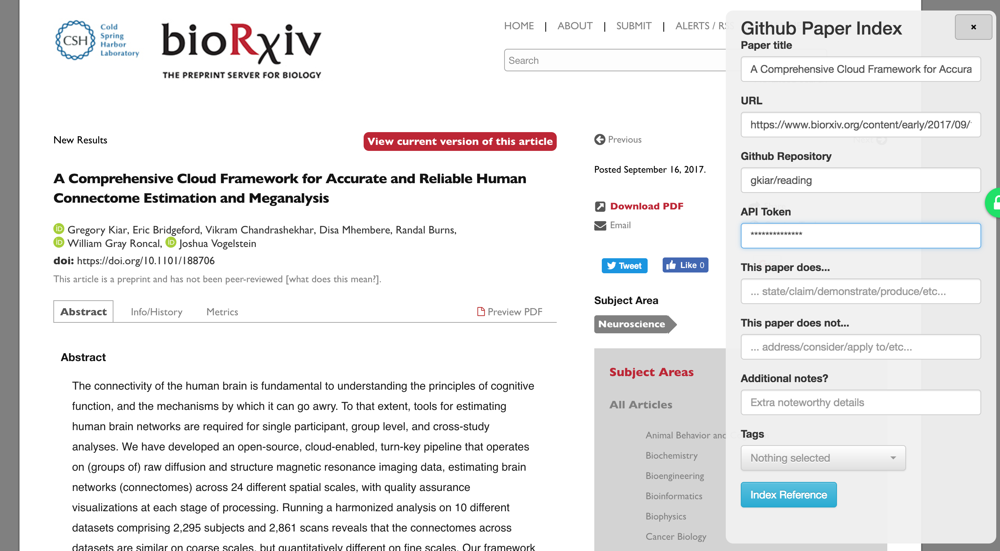

*Public Service Announcement: I renamed this project recently, so if you were using it, it is likely broken, and you should regenerate your link. Thanks!*

# Gitmarklet

Simple webform for creating structured and tagged Github issues from arbitrary users to arbitrary repos.

## Instructions

#### 1. Make and record a Github Token

You can do this by following:

> Top right menu > Settings > Developer Settings > Personal Access Tokens > Generate  new token

#### 2. Go to [https://gkiar.github.io/gitmarklet](https://gkiar.github.io/gitmarklet)

#### 3. Scroll down to the second form

#### 4. Specify a repository of your choice and enter your Token, and hit submit

#### 5. Copy the link that appeared to your clipboard

#### 6. Create a new bookmark with your link

#### 7. When reading a paper you want to record, click the bookmark and submit your entry!

